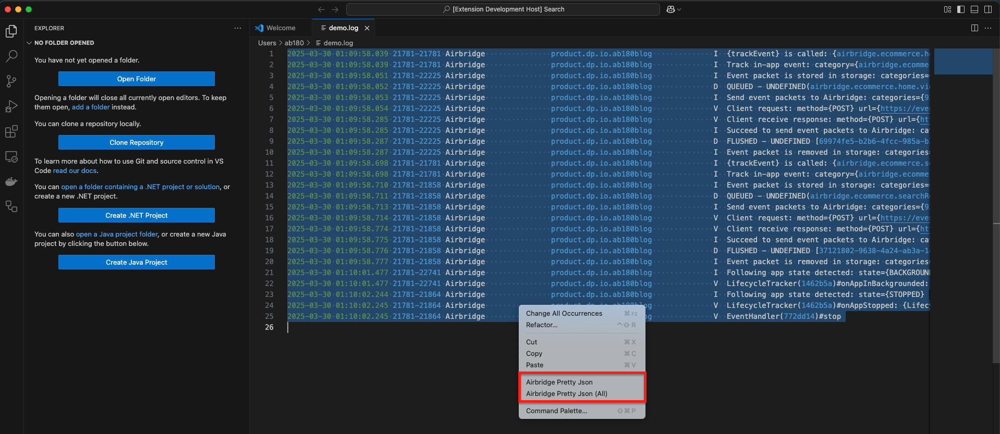

# Airbridge Pretty Json

This extension converts track event logs from the Airbridge Android SDK v4 into a prettified JSON format.

**NOTE**

- Paginated logs are ignored unless all pages are present.

## Command

### Airbridge Pretty Json

- It does not support multiple logs at once. If multiple logs are present, the very first log encountered will be processed.
- The formatted JSON string will be automatically written to the currently open file.

### Airbridge Pretty Json (All)

- It support multiple logs at once.
- The formatted JSON strings will be automatically written to new untitled files.

## Usage

### Airbridge Pretty Json

### Airbridge Pretty Json (All)

### Editor Context Menu

